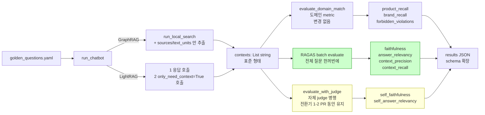

# [←](../README.md) RAGAS 도입 마이그레이션 기획

> **목적**: [`anna_aligned_evaluation_strategy.md`](anna_aligned_evaluation_strategy.md) 의 **1순위 작업 (`feat/rag_eval/ragas-integration`)** 의 실행 직전 기획 검토. 자체 LLM-as-judge → RAGAS 정식 전환 시 비교 가능성·비용·PR 분할·리스크를 정리하고 도식화.
>
> **상태**: 기획 단계 — 코드 변경 전. 사용자 검토 후 진행.

---

## 1. 왜 RAGAS 인가 (한 줄)

자체 구현 `evaluate_with_judge` 의 faithfulness 가 두 변형 모두 0 으로 측정되는 한계가 있고 (LightRAG `contexts=[]`, GraphRAG context 평탄화 손실), Anna(KOLAS 시험기관) 의 평가 사업이 RAGAS 의 4지표를 표준 어휘로 쓰기 때문.

---

## 2. 현재 파이프라인 vs 새 파이프라인 (다이어그램)

### 2.1 현재 (자체 judge, 한계 상태)

```mermaid
flowchart LR
    Q[golden_questions.yaml<br/>10 Q]
    Q --> RUN[run_chatbot<br/>provider별 분기]

    RUN -->|GraphRAG| GR[run_local_search<br/>context_data dict 평탄화 손실]
    RUN -->|LightRAG| LR[rag.aquery hybrid<br/>contexts=[] 영구 비어있음]

    GR --> RESP1[response + contexts<br/>의미 손실됨]
    LR --> RESP2[response + contexts=[]]

    RESP1 --> JUDGE[evaluate_with_judge<br/>자체 prompt × 2회 호출]
    RESP2 --> JUDGE

    JUDGE --> M1[faithfulness ← 영어 prompt]
    JUDGE --> M2[answer_relevancy ← 영어 prompt]
    JUDGE --> M3[context_precision = NaN ❌]

    M1 --> RESULT[results JSON]
    M2 --> RESULT
    M3 --> RESULT

    style M1 fill:#fcc,stroke:#c00
    style M3 fill:#fcc,stroke:#c00
    style RESP2 fill:#fcc,stroke:#c00
```

**현 결과** (2026-05-23 실측, [rag_evaluation_results.md](rag_evaluation_results.md)): faithfulness 둘 다 0, context_precision NaN, product_recall 3-5% (낮음).

### 2.2 새 파이프라인 (RAGAS 정식 + 병행 운영)



**병행 운영 이유**: 옛 점수 vs 새 점수 1-2 회 같이 측정해서 RAGAS 가 실제로 더 합리적인지 검증한 뒤 self-judge 제거.

---

## 3. 비교 가능성 매트릭스

| 비교 축 | 현재 | RAGAS 도입 후 (병행) | RAGAS 정착 후 (self 제거) |
|---|---|---|---|
| **GraphRAG vs LightRAG (동일 평가 framework)** | ✓ | ✓ (RAGAS) + ✓ (self) | ✓ (RAGAS) |
| **옛 자체 judge 점수 vs RAGAS 점수** | — | ✓ (한 JSON 안에 둘 다) | ✗ (옛 baseline 만 참조) |
| **외부 리더보드 (Allganize Claude 3.5 0.847)** | ✗ (지표 어휘 다름) | △ (RAGAS 지표는 같은 결, 데이터셋은 다름) | △ |
| **본인 K-Beauty 한국어 골든 추가 후** | — | △ (영어 골든 10 + 한국어 30 분리 보고) | △ |

**결론**: RAGAS 도입으로 잃는 비교는 **없음**. 오히려 외부 리더보드와 같은 어휘로 비교 가능해짐 (정확한 같은 축은 아니지만 결).

---

## 4. PR 분할 옵션 비교

| 옵션 | 작업 | 장점 | 단점 |
|---|---|---|---|
| **A. 한 PR (context 수정 + RAGAS + self-judge 제거)** | 다 묶어서 1 PR | history 깨끗 | 리뷰·롤백 단위 큼. self-judge 제거가 너무 일러서 회귀 발견 시 재현 어려움 |
| **B. 두 PR (context 수정 / RAGAS 도입 따로)** | PR1 = contexts 만, PR2 = RAGAS | 한 번에 한 가지만 | PR1 머지 후 contexts 가 self-judge 의 입력으로만 쓰이는 중간 상태 어색. self-judge 가 fixed contexts 받고 점수 바뀌면서 baseline 한 번 더 바뀜 |
| **C. 한 PR + 병행 운영 ★** | contexts 수정 + RAGAS 추가 + self-judge 유지 | 옛/새 점수 한 JSON 에 같이 박혀 비교 직접 가능. 회귀 검증 1회 만에 끝남 | self-judge 코드 잠시 같이 살아있음 (다음 작은 PR 에서 제거) |

**추천: 옵션 C**.

후속 정리 PR: `chore/rag_eval/decommission-self-judge` — 두 번의 평가 run 으로 RAGAS 신뢰 확인되면 self-judge 함수·호출·JSON 필드 제거. 매우 작은 PR.

---

## 5. API 사용량 / 비용 추정

### 5.1 1 provider 1 평가 run 당 호출 수

| 단계 | 호출 수 (10 Q 기준) | API | 무료? |
|---|---|---|---|
| 응답 생성 (RAG) | 10 | provider별 (OpenAI/Gemini/Groq) | OpenAI = $0.03 / Gemini = 0 / Groq = 0 |
| LightRAG context 추출 (only_need_context) | 10 | + same | 0 (Gemini) |
| RAGAS faithfulness | ~30-50 (claim 분해 + 검증) | Gemini Flash judge | 0 |
| RAGAS answer_relevancy | ~20-30 (역질문 생성 + embedding) | Gemini Flash + Gemini Embedding | 0 |
| RAGAS context_precision | ~10-20 (per chunk relevance) | Gemini Flash judge | 0 |
| RAGAS context_recall | ~10-20 (per ground_truth claim) | Gemini Flash judge | 0 |
| **self-judge (병행 유지)** | 20 (faithfulness + answer_relevancy) | Gemini Flash judge | 0 |
| **소계** | **약 120-200 call** | | |

### 5.2 한도 vs 사용량

- **Gemini Flash 2.0 무료 한도**: 15 RPM, 1500 RPD
- **GraphRAG + LightRAG 둘 다 한 번씩** = 약 400 call/일 → 한도의 **27%**
- **시간**: 15 RPM 제약상 약 13-15 분/provider. 두 provider 총 30 분 정도
- **OpenAI 비용** (GraphRAG-openai 변형): 한 평가 ~$0.03. 두 번 재실행 = $0.06

### 5.3 "한 번 vs 두 번"

- 평가 자체는 **provider 당 한 번씩만** 돌리면 됨 (RAGAS + self-judge 한 JSON 에 박힘)
- "두 번 도는 것 아니냐" 의 두 번은 _병행 측정 추가_ 의미 — 한 평가 안에서 같은 응답·context 에 metric 두 종류 계산하는 거라 응답 호출은 1번. judge 호출만 늘어남
- 시간 ~2배, 무료 한도 문제 X

---

## 6. 식별된 리스크 + 대응

| 리스크 | 원인 | 대응 |
|---|---|---|
| **GraphRAG `context_data` 스키마 불확실** | graphrag 라이브러리 버전마다 dict key 다름 | 첫 실행 시 1 질문에 대해 print 로 키 구조 확인 후 코드 finalize. sources / text_units / entities 등 후보 |
| **LightRAG 2회 호출 시간** | 응답 + context 따로 | Gemini Flash 라 무료지만 latency 2배. 첫 실행으로 시간 측정 후 OK |
| **RAGAS claim 분해 실패 응답** | 응답이 너무 짧거나 비정형 (예: "[CONFIG_MISSING]") | 현재 `evaluate_with_judge` 가 에러 응답엔 NaN 반환 — RAGAS wrapper 도 같은 가드 |
| **RPM 제한 hit** | 15 RPM × 13 분 ≈ 195 call 한도 | RAGAS 자체에 retry/backoff 있음. 실패 시 batch_size 줄이거나 sleep 추가 |
| **golden_questions.yaml 의 ground_truth 누락** | context_recall 필수 필드 | 마이그레이션 전 yaml 검사 — 모든 케이스에 ground_truth 있는지 grep |
| **langchain-google-genai 새 의존성** | 패키지 크기 + 호환성 | optional `[eval]` extra 안에 격리 — 평가 안 할 땐 미설치 가능 |

---

## 7. 산출 계획 (PR 내용)

### `feat/rag_eval/ragas-integration` (옵션 C)

1. **`pyproject.toml`**: `[eval]` extra 에 `ragas>=0.1.0`, `datasets>=2.16.0`, `langchain-google-genai>=2.0.0` 추가
2. **`tests/rag_eval/evaluate.py`**:
   - `_run_lightrag`: `only_need_context=True` 호출 추가, contexts 채움
   - `run_chatbot` GraphRAG 분기: `context_data` 의 `sources` / `text_units` 만 추출
   - `evaluate_with_ragas` 신규: RAGAS batch evaluate, 4 지표 계산
   - `evaluate_with_judge` 유지: 병행 운영
   - `run_evaluation`: 응답 수집 단계 → 그 다음 RAGAS batch + self-judge 양쪽 호출 → JSON 에 둘 다 박음
   - `summary` 필드 확장: `avg_context_precision`, `avg_context_recall`, `self_faithfulness`, `self_answer_relevancy`
3. **`tests/rag_eval/golden_questions.yaml`**: `ground_truth` 없는 케이스 보강 (있으면 skip)
4. **`tests/rag_eval/results/`**: GraphRAG + LightRAG 재실행한 새 JSON 2개
5. **`docs/rag_evaluation_results.md`**: baseline 표에 새 RAGAS 4 지표 컬럼 추가, 옛/새 점수 같이 표시
6. **`docs/rag_evaluation_framework.md`**: RAGAS 도구 섹션의 metric 정의를 RAGAS 공식 정의로 정확히 (현재는 개념 수준)

**예상 변경 라인 수**: evaluate.py +150~200, results.md 표 갱신, 다른 곳 +20

### 후속: `chore/rag_eval/decommission-self-judge`

위 PR 머지 후 추가 실행 1회 더로 RAGAS 신뢰 확인되면, self-judge 함수·호출·JSON 필드 제거. 작은 PR.

---

## 8. 사용자가 PR 전에 읽어 두면 좋은 자료

### 짧게 (15-30 분, 필수)
1. **RAGAS 공식 quickstart** — https://docs.ragas.io/en/stable/getstarted/index.html
   - dataset 형식, evaluate 호출 1 페이지
2. **RAGAS metric 정의 페이지** — https://docs.ragas.io/en/stable/concepts/metrics/index.html
   - **faithfulness**: claim 분해 → context 근거 검증
   - **answer_relevancy**: 역질문 생성 → 원 질문과 embedding cosine
   - **context_precision**: top-K 청크별 relevance + 순위 가중
   - **context_recall**: ground_truth claim 단위로 context 커버리지

### 길게 (1-2 시간, 권장)
3. **RAGAS 논문** — https://arxiv.org/abs/2309.15217 (EACL 2024, 9 페이지)
   - 왜 이 4 지표인지·인간 평가와의 상관도
4. **LightRAG `QueryParam` 문서** — https://github.com/HKUDS/LightRAG#querying
   - `only_need_context=True`, `only_need_prompt=True` 옵션 설명

### 면접 자산 결 (선택, 30 분)
5. **ARES 논문** — https://arxiv.org/abs/2311.09476
   - RAGAS 대안. judge LLM 을 합성 학습으로 직접 파인튜닝. RAGAS 보다 정확도 ↑ 보고
   - 면접 가산: "RAGAS 의 LLM-as-judge 한계를 ARES 가 어떻게 우회하려 했는지 인지"
6. **Allganize 리더보드 페이지** — https://huggingface.co/datasets/allganize/RAG-Evaluation-Dataset-KO
   - 본인 RAGAS 점수를 어떤 모델과 비교할지 미리 파악

---

## 9. 결정 사항 + 다음 단계

**결정 (사용자 확인 필요)**:
- [ ] 옵션 C (한 PR + 병행 운영) 으로 진행
- [ ] §6 의 리스크 대응 합의
- [ ] golden_questions.yaml 의 ground_truth 부족하면 보강 후 진입

**확인 후 코드 작업 순서**:
1. golden_questions.yaml 의 ground_truth 커버리지 점검
2. pyproject.toml 의존성 추가 + `uv sync`
3. LightRAG context 추출 (B-1) — 단발 sanity test
4. GraphRAG context 추출 (B-2) — 단발 sanity test (graphrag context_data 키 구조 확인)
5. RAGAS wrapper 도입 (C)
6. run_evaluation 흐름 갱신
7. 두 provider 재실행
8. docs 갱신

---

## 10. 변경 이력

- **2026-06-01 v1**: 기획 단계. anna_aligned_evaluation_strategy.md 의 1순위를 코드 작업 전 사전 검토. 옵션 C(병행 운영) 추천. 다이어그램 2종, 비교 매트릭스, 비용 추정, 리스크 6종 정리.
